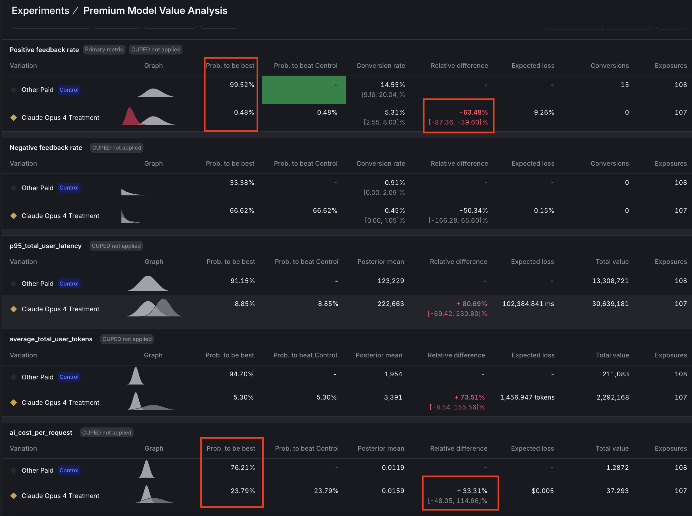

# AI Experimentation with LaunchDarkly

<figure style="margin: 20px 0;">
  
  <figcaption style="margin-top: 8px; font-style: italic; color: #666; text-align: center;">LaunchDarkly Logo</figcaption>
</figure>

LaunchDarkly revolutionizes how builders and engineers approach AI development by bringing sophisticated experimentation capabilities directly into production environments. LaunchDarkly's AI Configs let you swap models, tweak prompts, and test different configurations **without redeploying code**. Think of it as A/B testing for AI - change your model from Anthropic's Claude to Amazon Nova or Meta Llama, adjust parameters on the fly, and see which setup actually performs best with real data. You can target specific users ("premium customers get the fancy model"), run controlled experiments, and track token efficiency. Make changes in a web UI and your agent instantly picks them up. No more guessing which model is best or hardcoding configurations. Just experiment, measure, and ship the winner.

---

## Claude Code Users: Use Skills!

If you're using **Claude Code** (Anthropic's CLI), you have access to built-in LaunchDarkly AI Config skills. These are slash commands that guide you through creating and managing AI Configs interactively.

### Quick Reference: Available Skills

| Skill | Description |
|-------|-------------|
| `/aiconfig-projects` | Create a new LaunchDarkly project |
| `/aiconfig-create` | Create an AI Config with variations |
| `/aiconfig-sdk` | Instrument your Python app with the AI SDK |
| `/aiconfig-ai-metrics` | Add AI metrics tracking |
| `/aiconfig-targeting` | Configure targeting rules |
| `/aiconfig-segments` | Create user segments for targeting |
| `/aiconfig-tools` | Create and attach tools to configs |
| `/aiconfig-variations` | Add/update variations in a config |
| `/aiconfig-context-basic` | Build user contexts |
| `/aiconfig-context-advanced` | Advanced context patterns |
| `/aiconfig-custom-metrics` | Track custom business metrics |
| `/aiconfig-online-evals` | Set up LLM-as-a-judge evaluations |

**To use a skill**, simply type the slash command in Claude Code:
```
/aiconfig-create
```

Claude will guide you through the process interactively, asking for your project key, configuration details, and generating the appropriate API calls.

---

## Scenario

Your mission: Figure out which AI model is most token-efficient for your Pet Store agent. Instead of guessing, you'll run a proper experiment with real data. Set up two (or more!) model variations, split traffic between them, and let the metrics tell you which one uses tokens more efficiently.

## Success Criteria and Score Validation

By the end, you'll have:

- ✅ LaunchDarkly account hooked up and ready to roll
- ✅ A LaunchDarkly AI Config with at least 2 different model variations
- ✅ Your AI agent code instrumented to retrieve configs from LaunchDarkly
- ✅ A live experiment collecting model token usage data using LaunchDarkly AI Experiments
- ✅ Actual metrics showing which model is more efficient

**Pro tip:** This is one of the more straightforward competition sections - most of the code patterns are already written for you. Plus, you get to play with multiple AI models without writing a ton of code. Win-win!

---

## Build Your First AI Experiment: LaunchDarkly Demo

**PLACEHOLDER FOR VIDEO**

---

## Guidance

### 1. Get Your LaunchDarkly Account Set Up

#### Quick Token Explainer

You'll need two kinds of keys:
- **API Access Token** (starts with `api-`): Lets Claude Code/your IDE talk to LaunchDarkly to create and edit AI Configs
- **SDK Key** (starts with `sdk-`): Your agent uses this to fetch configs at runtime

<details>
<summary><b>1a. Create your LaunchDarkly Account</b></summary>

1. Go to [LaunchDarkly's signup page](https://launchdarkly.com)
2. Create a free account if you don't have one
3. Complete the onboarding flow

</details>

<details>
<summary><b>1b. Create a LaunchDarkly API Access Token</b></summary>

1. Navigate to **Organization Settings** → **Authorization** → **Create token**
2. Configure:
   - **Name**: `workshop-token` (or any descriptive name)
   - **Role**: Select **Writer** or **LaunchDarkly Developer**
3. Copy and save this token immediately (only shown once)

For detailed instructions, see [Creating API access tokens](https://docs.launchdarkly.com/home/account-security/api-access-tokens#creating-api-access-tokens)

<figure style="margin: 20px 0;">
  
  <figcaption style="margin-top: 8px; font-style: italic; color: #666; text-align: center;">Creating a new API access token</figcaption>
</figure>

<figure style="margin: 20px 0;">
  
  <figcaption style="margin-top: 8px; font-style: italic; color: #666; text-align: center;">Configuring token name and role</figcaption>
</figure>

<figure style="margin: 20px 0;">
  
  <figcaption style="margin-top: 8px; font-style: italic; color: #666; text-align: center;">Copying the API token (shown only once)</figcaption>
</figure>

</details>

<details>
<summary><b>1c. Retrieve the LaunchDarkly SDK Key</b></summary>

1. Navigate to **Project settings** → **Environments** → Select your environment
2. Copy the **SDK key** (starts with `sdk-`)

For more details, see [Finding your SDK key](https://docs.launchdarkly.com/sdk/concepts/client-side-server-side#keys)

<figure style="margin: 20px 0;">
  
  <figcaption style="margin-top: 8px; font-style: italic; color: #666; text-align: center;">Accessing project settings from the sidebar</figcaption>
</figure>

<figure style="margin: 20px 0;">
  
  <figcaption style="margin-top: 8px; font-style: italic; color: #666; text-align: center;">Copy the SDK key from the environment settings</figcaption>
</figure>

</details>

<details>
<summary><b>1d. Store Your Tokens</b></summary>

**For Claude Code Skills**, set the environment variable:
```bash
export LAUNCHDARKLY_ACCESS_TOKEN="api-xxxxxxxx-xxxx-xxxx-xxxx-xxxxxxxxxxxx"
```

**For your agent runtime**, store the SDK key:
- Add to AWS Secrets Manager in your AWS Account, OR
- Set as environment variable: `export LAUNCHDARKLY_SDK_KEY="sdk-xxxxx"`

</details>

<details>
<summary><b>1e. Configure Your IDE (Choose Your Approach)</b></summary>

#### Option A: Claude Skills (Recommended)

If you're using **Claude Code**, you already have access to all the `/aiconfig-*` skills. Just make sure your `LAUNCHDARKLY_ACCESS_TOKEN` environment variable is set and start using the skills!

No additional configuration needed.

#### Option B: MCP Server (For Cursor, Claude Desktop, Kiro)

The LaunchDarkly MCP server configuration is already in Coder templates. You can update it with your API key before provisioning your workspace(s). Check [Coder Guidance](https://catalog.workshops.aws/launchdarkly-ai-config-bedrock/en-US) for details.

If you need to configure it manually, create/update your MCP configuration file:
- **For Cursor**: `~/.cursor/mcp.json`
- **For Claude Desktop**: `claude_desktop_config.json`
- **For AWS Kiro**: See [Kiro IDE documentation](https://kiro.dev/)

```json
{
  "mcpServers": {
    "LaunchDarkly": {
      "command": "npx",
      "args": [
        "-y",
        "--package",
        "@launchdarkly/mcp-server",
        "--",
        "mcp",
        "start",
        "--api-key",
        "api-xxxxxxxx-xxxx-xxxx-xxxx-xxxxxxxxxxxx"
      ]
    }
  }
}
```

</details>

---

### 2. Create Your First AI Config (The Fun Part!)

Time to create an AI Config! This is basically a template for your agent that includes which model to use, what temperature, system prompts, etc. You can create multiple "variations" and swap between them instantly.

For a complete walkthrough, see the [AI Configs quickstart guide](https://docs.launchdarkly.com/home/ai-configs/quickstart).

<details>
<summary><b>2a. Using Claude Skills (Recommended)</b></summary>

#### Step 1: Create a Project (if needed)

```
/aiconfig-projects
```

Claude will guide you through creating a new LaunchDarkly project. Use `pet-store-agent` as the project key.

#### Step 2: Create Your AI Config

```
/aiconfig-create
```

Claude will walk you through:
- Setting the project key (`pet-store-agent`)
- Choosing **agent mode** (for agentic workflows)
- Configuring your model (e.g., `Bedrock.us.anthropic.claude-3-7-sonnet-20250219-v1:0`)
- Adding your system instructions (the pet store agent prompt)
- Setting up custom parameters (temperature, max_tokens, etc.)

#### Step 3: Add Tools to Your Config

```
/aiconfig-tools
```

This helps you create and attach tools like:
- `retrieve_product_info` - Search product catalog
- `retrieve_pet_care` - Search pet care knowledge
- `get_inventory` - Check inventory via Lambda
- `get_user_by_id` - Get user info via Lambda
- `get_user_by_email` - Get user by email via Lambda

#### Step 4: Add a Second Variation (For Experimentation)

```
/aiconfig-variations
```

Add a second model variation (e.g., Nova Pro or a different Claude model) to compare performance. Keep the tools and parameters the same - just change the model.

</details>

<details>
<summary><b>2b. Using LaunchDarkly Console (Alternative)</b></summary>

See detailed instructions: [Creating AI Configs](https://docs.launchdarkly.com/home/ai-configs/create) and [Agent-based configurations](https://docs.launchdarkly.com/home/ai-configs/agents)

1. Navigate to **AI Configs** → **Create AI Config** → Select **Agent-based**
2. Configure:
   - **Name**: Pet Store Agent
   - **Key**: `pet-store-agent`
   - **Variation name**: `base-config`
3. Set model configuration:
   - **Model provider**: Select your preferred provider
   - **Model**: Select your preferred model
   - **Parameters**: Add temperature (0.7) and max_tokens (4096)
4. Add your agent instructions in the **Goal or task** field
5. Review and save
6. Go to **Targeting** tab → Edit default rule → Select `base-config` → Save

<figure style="margin: 20px 0;">
  
  <figcaption style="margin-top: 8px; font-style: italic; color: #666; text-align: center;">Creating a new agent-based AI Config</figcaption>
</figure>

<figure style="margin: 20px 0;">
  
  <figcaption style="margin-top: 8px; font-style: italic; color: #666; text-align: center;">Enabling targeting to serve base-config variation</figcaption>
</figure>

</details>

<details>
<summary><b>2c. (Optional) Define Tools in LaunchDarkly</b></summary>

**Do you need this step?** Only if you're using LangGraph, Strands, or other open-source frameworks and want to dynamically configure which tools your agent can use. If you're using Amazon Bedrock Agents with Knowledge Bases and Action Groups, **skip this section**.

#### Using Claude Skills

```
/aiconfig-tools
```

This skill will guide you through creating tool schemas for:

**RAG Tools (LlamaIndex or Bedrock KB):**
- `retrieve_product_info` / `ProductInformation` - Search product catalog
- `retrieve_pet_care` / `PetCaringKnowledge` - Search pet care knowledge

**Lambda Tools:**
- `get_inventory` - Check product inventory
- `get_user_by_id` - Get user by ID
- `get_user_by_email` - Get user by email

#### Using LaunchDarkly Console

1. In the LaunchDarkly sidebar, click **Library** in the AI section
2. Click the **Tools** tab
3. Click **Create tool**
4. Fill in the tool configuration (key, description, JSON schema)
5. Click **Save**

</details>

---

### 3. Hook Up LaunchDarkly SDK in Your AI Agent Code

Now we connect your agent to LaunchDarkly so it can grab configs at runtime. This is a simple pattern - you'll add about 20 lines of code.

<details>
<summary><b>Click to expand SDK integration details</b></summary>

#### Using Claude Skills for Guidance

```
/aiconfig-sdk
```

This skill will show you exactly how to:
- Initialize the LaunchDarkly AI SDK
- Build user contexts
- Fetch AI Configs in agent mode
- Extract model configuration
- Track metrics

You can also use these supporting skills:
- `/aiconfig-context-basic` - Build user contexts for targeting
- `/aiconfig-ai-metrics` - Add comprehensive metrics tracking

#### Install Dependencies

```bash
pip install launchdarkly-server-sdk launchdarkly-server-sdk-ai
```

#### Universal Instrumentation Pattern

Every agent follows these 5 steps:

**Step 1: Initialize SDK (once at startup)**

```python
import ldclient
from ldclient import Context
from ldai.client import LDAIClient

ldclient.set_config(ldclient.Config(os.environ.get('LAUNCHDARKLY_SDK_KEY')))
ld_client = ldclient.get()
ai_client = LDAIClient(ld_client)
```

**Step 2: Build Context (per request)**

```python
context = Context.builder("user-123") \
    .set("subscription_status", "premium") \
    .set("query_complexity", "high") \
    .build()
```

**Step 3: Retrieve Configuration**

```python
from ldai.client import AIAgentConfigRequest, AIAgentConfigDefault

agent = ai_client.agent(
    AIAgentConfigRequest(
        key="pet-store-agent",
        default_value=AIAgentConfigDefault(enabled=False)
    ),
    context
)

# Extract configuration
model_name = agent.model.name
provider_name = agent.provider.name
instructions = agent.instructions
parameters = agent.model._parameters if agent.model else {}
custom = agent.model._custom if agent.model else {}
tools_config = parameters.get("tools", [])
tracker = agent.tracker
```

**Step 4: Build Tools Dynamically**

```python
def build_tools_from_config(tools_config, global_config, aws_region):
    tools = []
    for tool_config in tools_config:
        tool_name = tool_config.get("name")
        tool_custom = tool_config.get("custom", {})
        tool_params = tool_config.get("parameters", {})
        merged_config = {**global_config, **tool_params, **tool_custom}

        if tool_name in TOOL_BUILDERS:
            tool = TOOL_BUILDERS[tool_name](merged_config, aws_region)
            tools.append(tool)
    return tools
```

**Step 5: Track Metrics**

```python
tracker = agent.tracker

try:
    # Use track_duration_of() wrapper for automatic duration tracking
    result = tracker.track_duration_of(lambda: agent.invoke(input_))

    tracker.track_success()

    from ldai.tracker import TokenUsage
    usage = TokenUsage(input=100, output=200, total=300)
    tracker.track_tokens(usage)

except Exception as e:
    tracker.track_error()
    raise
```

**Available tracking methods:**
- `tracker.track_duration_of(callable)` - Wraps execution and automatically tracks duration
- `tracker.track_success()` - Successful completions
- `tracker.track_error()` - Errors
- `tracker.track_tokens(TokenUsage(...))` - Token usage
- `tracker.track_time_to_first_token(ms)` - Latency

For comprehensive SDK documentation, see:
- [Python AI SDK](https://docs.launchdarkly.com/sdk/ai/python)
- [AI Config SDK feature guide](https://docs.launchdarkly.com/sdk/features/ai-config)
- [Tracking AI metrics](https://docs.launchdarkly.com/sdk/features/ai-metrics)

</details>

---

### 4. Update Target Configuration

Modify your LaunchDarkly AI Config targeting to dynamically control which users receive configurations.

<details>
<summary><b>Click to expand targeting details</b></summary>

#### Using Claude Skills

```
/aiconfig-targeting
```

This skill will guide you through:
- Adding targeting rules based on user attributes (e.g., `subscription_status`)
- Setting up percentage rollouts for experiments
- Configuring the default rule
- Managing segment-based targeting

You can also use `/aiconfig-segments` to create reusable user segments:
```
/aiconfig-segments
```

#### Using LaunchDarkly Console

1. Navigate to AI Config → **Targeting** tab
2. Click **+ Add rule**
3. Configure:
   - **Name**: "Premium Users"
   - **Condition**: `subscription_status` is one of `premium`
   - **Serve**: `base-config` variation
4. Ensure Default rule serves `base-config`
5. Save changes

<figure style="margin: 20px 0;">
  
  <figcaption style="margin-top: 8px; font-style: italic; color: #666; text-align: center;">Saving targeting rule changes</figcaption>
</figure>

Learn more about [targeting AI Configs](https://docs.launchdarkly.com/home/ai-configs/target)

</details>

---

### 5. Test AI Config and Monitor Performance (Optional)

<details>
<summary><b>Click to expand testing details</b></summary>

**5a.** Send prompt messages using different user contexts:

```python
test_cases = [
    {"prompt": "What's the price of Doggy Delights?",
     "context": {"user_id": "guest-001", "subscription_status": "guest"}},
    {"prompt": "I need detailed care instructions for a puppy",
     "context": {"user_id": "premium-001", "subscription_status": "premium"}}
]

for test in test_cases:
    response = agent.invoke(test["prompt"], test["context"])
```

**5b.** Monitor AI Config behavior in the LaunchDarkly console:
- Navigate to AI Configs → `pet-store-agent` → **Monitoring** tab
- Observe: Request volume, token usage, response times, error rates, cost per variation

For more details, see [Monitoring AI Configs](https://docs.launchdarkly.com/home/ai-configs/monitor)

**5c.** Validate configuration changes in real-time to ensure targeting rules work as expected

</details>

---

### 6. Run Your First AI Experiment (This Is Where It Gets Cool!)

Here's where the magic happens. You're going to run a proper A/B test between two models and see which one is more token-efficient.

<details>
<summary><b>Click to expand experiment details</b></summary>

#### Add Model Variations

Before creating your experiment, make sure you have at least two variations.

**Using Claude Skills:**
```
/aiconfig-variations
```

This will guide you through adding a new variation with a different model (e.g., Nova Pro) while keeping tools and parameters the same.

#### Configure Experiment

Navigate to **AI Configs → pet-store-agent**. In the right navigation menu, click the **+** (plus) sign next to **Experiments** to create a new experiment.

**Experiment Design:**

| Setting | Value |
|---------|-------|
| **Experiment type** | Feature change (default) |
| **Name** | Pet Store Agent Model Performance |
| **Hypothesis** | The alternative model will provide better token efficiency for our pet store queries. |
| **Randomize by** | user |
| **Metrics** | `average_total_user_tokens` |

**Audience Targeting:**

| Setting | Value |
|---------|-------|
| **Flag or AI Config** | pet-store-agent |
| **Targeting rule** | Default rule |

**Audience Allocation:**

| Setting | Value |
|---------|-------|
| **Variations served outside experiment** | base-config |
| **Sample size** | 100% |
| **Variations split** | base-config: 50%, model-variant-2: 50% |
| **Control** | base-config |

**Statistical Approach:**

| Setting | Value |
|---------|-------|
| **Statistical approach** | Bayesian |
| **Threshold** | 90% (or 95% for mission-critical features) |

Click **"Save"** to create the experiment.

<figure style="margin: 20px 0;">
  
  <figcaption style="margin-top: 8px; font-style: italic; color: #666; text-align: center;">Example experiment configuration in LaunchDarkly</figcaption>
</figure>

**IMPORTANT:** For this competition, **DO NOT start the experiment** yet. Just save the experiment configuration. Starting an experiment will modify your targeting rules. You'll get full credit for having a properly configured experiment, even if it's not running.

For detailed guidance, see [Experimenting with AI Configs](https://docs.launchdarkly.com/home/ai-configs/experimentation)

</details>

---

### 7. Run End-to-End Testing and Analyze Results (Optional)

<details>
<summary><b>Click to expand testing details</b></summary>

**7a.** Generate varied traffic for your experiment:

```python
import random

for i in range(50):
    user_id = f"experiment-user-{i:03d}"
    context = {
        "user_id": user_id,
        "subscription_status": random.choice(["guest", "active", "premium"])
    }
    prompts = [
        "What's the price of Doggy Delights?",
        "How should I care for a new kitten?",
        "Tell me about your cat products",
        "I need food for my dog"
    ]
    response = agent.invoke(random.choice(prompts), context)
```

**7b.** Check your results in the LaunchDarkly console

Navigate to your experiment and click the **Results** tab to see which model is more token-efficient.

<figure style="margin: 20px 0;">
  
  <figcaption style="margin-top: 8px; font-style: italic; color: #666; text-align: center;">Example experiment results showing metrics and statistical analysis</figcaption>
</figure>

</details>

---

## Evaluate Your Solution

**Competition Insight:** Submit your evaluation in Account Scoreboard. Our scoring system preserves your best result across all your submissions - so experiment freely! The more you experiment and submit, the better your competitive advantage will be.

**Parameters for evaluation:**
- Project Id - required
- Environment - required
- AI Config - required

---

## You're Done!

Congrats - you just ran a professional-grade AI experiment! You can now swap models, run tests, and optimize your agent based on real data.

**Want to go deeper?** Check out these resources:
- [LaunchDarkly AI Configs docs](https://docs.launchdarkly.com/ai)
- [LaunchDarkly AI Config with Amazon Bedrock Workshop](https://catalog.workshops.aws/launchdarkly-ai-config-bedrock/en-US)
- [Multi-Agent Tutorial](https://github.com/launchdarkly-labs/devrel-agents-tutorial)

---

## Troubleshooting

<details>
<summary><b>SDK Key and API Token Issues</b></summary>

- Verify `LAUNCHDARKLY_ACCESS_TOKEN` is set for Claude Skills
- Verify `LAUNCHDARKLY_SDK_KEY` is set for your agent runtime
- API tokens start with `api-`, SDK keys start with `sdk-`
- Ensure tokens have appropriate permissions (Writer or LaunchDarkly Developer role)

</details>

<details>
<summary><b>AI Config Not Found</b></summary>

- Verify the AI Config key matches exactly (case-sensitive)
- Ensure targeting is enabled and a variation is being served
- Check that the SDK key is from the correct environment

</details>

<details>
<summary><b>Model Configuration Errors</b></summary>

- Verify the `modelConfigKey` format: `Provider.ModelId`
- Example: `Bedrock.us.anthropic.claude-3-7-sonnet-20250219-v1:0`
- Ensure you have access to the model in your AWS account

</details>

<details>
<summary><b>Tracking and Metrics Issues</b></summary>

- Make sure you're calling `tracker.track_success()` or `tracker.track_error()`
- Use `tracker.track_tokens(TokenUsage(...))` to track token usage
- In Lambda contexts, call `ldclient.get().flush()` before the function terminates

</details>

<details>
<summary><b>Context and Targeting Issues</b></summary>

- Context keys must be strings
- Attribute values should match targeting rule conditions exactly
- Use `/aiconfig-context-basic` skill for guidance on building contexts

</details>

<details>
<summary><b>Quick Diagnostic Checklist</b></summary>

1. ✅ `LAUNCHDARKLY_ACCESS_TOKEN` environment variable set?
2. ✅ `LAUNCHDARKLY_SDK_KEY` environment variable set?
3. ✅ AI Config exists in the correct project?
4. ✅ Targeting is enabled with a default rule?
5. ✅ SDK is initialized before fetching config?
6. ✅ Context is built with the correct user key?

</details>

Still having issues? Check the [LaunchDarkly Documentation](https://docs.launchdarkly.com/) or the workshop Troubleshooting page for general guidance.
