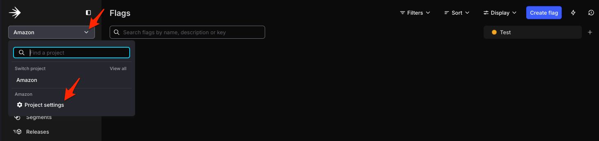
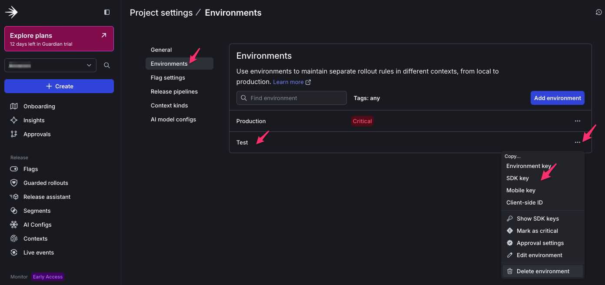

# AI Experimentation with LaunchDarkly

<figure style="margin: 20px 0;">
  
  <figcaption style="margin-top: 8px; font-style: italic; color: #666; text-align: center;">LaunchDarkly Logo</figcaption>
</figure>

LaunchDarkly revolutionizes how builders and engineers approach AI development by bringing sophisticated experimentation capabilities directly into production environments. LaunchDarkly's AI Configs let you swap models, tweak prompts, and test different configurations **without redeploying code**. Think of it as A/B testing for AI - change your model from one provider to another (like Amazon Nova or Meta Llama), adjust parameters on the fly, and see which setup actually performs best with real data. You can target specific users ("premium customers get the fancy model"), run controlled experiments, and track token efficiency. Make changes in a web UI and your agent instantly picks them up. No more guessing which model is best or hardcoding configurations. Just experiment, measure, and ship the winner. 🚀

---

## Scenario

Your mission: Figure out which AI model is most token-efficient for your Pet Store agent. Instead of guessing, you'll run a proper experiment with real data. Set up two (or more!) model variations, split traffic between them, and let the metrics tell you which one uses tokens more efficiently.

## Success Criteria and Score Validation

By the end, you'll have:

- ✅ LaunchDarkly account hooked up and ready to roll
- ✅ A LaunchDarkly AI Config with at least 2 different model variations
- ✅ Your AI agent code instrumented to retrieve configs from LaunchDarkly
- ✅ A live experiment collecting model token usage data using LaunchDarkly AI Experiments
- ✅ Actual metrics showing which model is more efficient

**Pro tip:** This is one of the more straightforward competition sections - most of the code patterns are already written for you. Plus, you get to play with multiple AI models without writing a ton of code. Win-win!

---

## Build Your First AI Experiment: LaunchDarkly Demo

**PLACEHOLDER FOR VIDEO**

---

## Guidance

### 1. Get Your LaunchDarkly Account Set Up

#### 1a. Create your LaunchDarkly Account

<details>
<summary>Click to expand instruction details</summary>

Create your LaunchDarkly account if you don't have one by going to [LaunchDarkly's signup page](https://launchdarkly.com)

</details>

#### Explanation of LaunchDarkly token keys

You'll need two kinds of token keys from your LaunchDarkly account (don't worry, it's simple):

- **API Access Token** (starts with `api-`): Lets your Agentic IDE (e.g Kiro) talk to LaunchDarkly to create and edit AI Configs using LaunchDarkly MCP server + LaunchDarkly API Access token also used as the evaluation mechanism for each task you complete
- **SDK Key** (starts with `sdk-`): Your Pet Store AI agent uses this to fetch LaunchDarkly AI Configs at runtime

Grab both and you're golden. 👍

#### 1b. Create a LaunchDarkly API access token

<details>
<summary>Click to expand instruction details</summary>

1. Navigate to **Organization Settings** → **Authorization** → **Create token**

<figure style="margin: 20px 0;">
  
  <figcaption style="margin-top: 8px; font-style: italic; color: #666; text-align: center;">LaunchDarkly API Access Token Create</figcaption>
</figure>

2. Configure:
   - **Name**: `workshop-mcp-token` (or any descriptive name)
   - **Role**: Select **Writer**

<figure style="margin: 20px 0;">
  
  <figcaption style="margin-top: 8px; font-style: italic; color: #666; text-align: center;">LaunchDarkly API Access Token Name</figcaption>
</figure>

3. Copy and save this token somewhere on your local computer (only shown once)

<figure style="margin: 20px 0;">
  
  <figcaption style="margin-top: 8px; font-style: italic; color: #666; text-align: center;">LaunchDarkly API Access Token Copy</figcaption>
</figure>

Create a LaunchDarkly API access token for LaunchDarkly's MCP server and API calls (for score validation) using a writer role.

</details>

#### 1c. Retrieve the LaunchDarkly SDK key

<details>
<summary>Click to expand instruction details</summary>

Retrieve the LaunchDarkly SDK key that starts with `sdk-xxxxx` from the test environment in your LaunchDarkly project to be used later to instrument your AI Agent code to use LaunchDarkly's AI Configs.

<figure style="margin: 20px 0;">
  
  <figcaption style="margin-top: 8px; font-style: italic; color: #666; text-align: center;">LaunchDarkly Project Environment</figcaption>
</figure>

<figure style="margin: 20px 0;">
  
  <figcaption style="margin-top: 8px; font-style: italic; color: #666; text-align: center;">LaunchDarkly SDK Key retrieval</figcaption>
</figure>

</details>

#### 1d. Add the LaunchDarkly API Access token to AWS Secrets Manager in your AWS Account used for this workshop

<details>
<summary>Click to expand instruction details</summary>

Same as other secrets, you can update LaunchDarkly secrets using either: coding agent, AWS API or AWS Management Console.

You can find exact key name in Events Outputs which are pre-created by CFN templates:

- **LaunchDarklyAPIKeySecret** - Secret name for LaunchDarkly API Key, default: `partner-launchdarkly-api-key`
- **LaunchDarklySDKKeySecret** - Secret name for LaunchDarkly SDK Key, default: `partner-launchdarkly-sdk-key`

</details>

#### 1e. Install LaunchDarkly Agent Skills and MCP Server (Recommended)

For the best experience, install **both** Agent Skills and the MCP Server. They complement each other:
- **Agent Skills** teach your AI assistant LaunchDarkly workflows and best practices
- **MCP Server** provides direct API access for creating and managing AI Configs

##### Step 1: Install Agent Skills

Agent Skills are text-based playbooks that work with any editor supporting the [Agent Skills Open Standard](https://github.com/launchdarkly/agent-skills).

**Clone the repository:**

```bash
git clone https://github.com/launchdarkly/agent-skills.git
```

Or ask your AI assistant:

```
Download and install skills from https://github.com/launchdarkly/agent-skills
```

**Verify installation:** Type `/aiconfig` in your editor - you should see autocomplete suggestions.

##### Step 2: Install MCP Server

The MCP Server enables direct LaunchDarkly API access from your IDE.

**Repository:**

```bash
https://github.com/launchdarkly/mcp-server
```

**Configure your IDE's MCP settings:**

| IDE | Config File |
|-----|-------------|
| Cursor | `~/.cursor/mcp.json` |
| AWS Kiro | See [Kiro docs](https://kiro.dev/) |

**Add this configuration:**

```json
{
  "mcpServers": {
    "LaunchDarkly": {
      "command": "npx",
      "args": [
        "-y",
        "--package",
        "@launchdarkly/mcp-server",
        "--",
        "mcp",
        "start",
        "--api-key",
        "api-xxxxxxxx-xxxx-xxxx-xxxx-xxxxxxxxxxxx"
      ]
    }
  }
}
```

##### Step 3: Set your API token

```bash
export LAUNCHDARKLY_ACCESS_TOKEN="api-xxxxx"
```

Get your token from [LaunchDarkly Authorization settings](https://app.launchdarkly.com/settings/authorization). **Required:** Writer role.

##### Step 4: Restart your editor

Close and reopen your editor. Verify:
- LaunchDarkly MCP server appears in your IDE's MCP server list
- `/aiconfig` shows autocomplete suggestions

Learn more: [LaunchDarkly MCP Documentation](https://docs.launchdarkly.com/home/getting-started/mcp-server)

---

### 2. Create Your First AI Config (The Fun Part!)

This is basically a template for your agent that includes which model to use, what temperature, system prompts, etc. You can create multiple "variations" and swap between them instantly.

For a complete walkthrough, see the [AI Configs quickstart guide](https://docs.launchdarkly.com/home/ai-configs/quickstart).

#### 2a. Using Agent Skills or MCP Server (Recommended)

<details>
<summary>Click to expand instruction details</summary>

The fastest way: Just ask your IDE to do it for you.

Simply ask your IDE:

```
Create an AI Config in LaunchDarkly with this configuration:
```

```json
{
  "LD_PROJECT_KEY": "pet-store-agent",
  "ai_config": {
    "key": "pet-store-agent",
    "name": "Pet Store Agent",
    "mode": "agent"
  },
  "variation": {
    "key": "base-config",
    "name": "Base Config",
    "modelConfigKey": "Bedrock.anthropic.claude-3-7-sonnet-20250219-v1:0",
    "instructions": "You are an online pet store assistant for staff. Your job is to analyze customer inputs, use the provided external tools and data sources as required, and then respond in json-only format following the schema below. Always maintain a warm and friendly tone in user message and pet advice fields.\n\n# Execution Plan:\n1. Analyze customer input and execute the next two steps (2 and 3) in parallel.\n2-a. Use UserManagement to identify user details and check if user is a subscribed customer.\n2-b. If the user is a subscribed customer, use PetCaringKnowledge if required to find pet caring details.\n3-a. Use ProductInformation to identify if we have any related product.\n3-b. For identified products, use InventoryManagement to find product inventory details.\n4. Generate final response in JSON based on all compiled information.\n\n# Business Rules:\nDon't ask for further information. You always need to generate a final response only.\nProduct identifiers are for internal use and must not appear in customer facing response messages.\nWhen preparing a customer response, use the customer's first name instead of user id or email address when possible.\nReturn Error status with a user-friendly message starting with \"We are sorry...\" when encountering internal issues - such as system errors or missing data.\nReturn Reject status with a user-friendly message starting with \"We are sorry...\" when requested products are unavailable.\nReturn Accept status with appropriate customer message when requested product is available.\nAlways avoid revealing technical system details in customer-facing message field when status is Accept, Error, or Reject.\nWhen an order can cause the remaining inventory to fall below or equal to the reorder level, flag that product for replenishment.\nOrders over $300 qualify for a 15% total discount. In addition, when buying multiple quantities of the same item, customers get 10% off on each additional unit (first item at regular price).\nShipping charges are determined by order total and item quantity. Orders $75 or above: receive free shipping. Orders under $75 with 2 items or fewer: incur $14.95 flat rate. Orders under $75 with 3 items or more: incur $19.95 flat rate.\nDesignate the customer type as Subscribed only when the user exists and maintains an active subscription. For all other cases, assume the customer type as Guest.\nFree pet care advice should only be provided when required to customers with active subscriptions in the allocated field for pet advice.\nFor each item included in an order, determine whether to trigger the inventory replenishment flag based on the projected inventory quantities that will remain after the current order is fulfilled.\n\n# Sample 1 Input:\nA new user is asking about the price of Doggy Delights?\n\n# Sample 1 Response:\n{\n    \"status\": \"Accept\",\n    \"message\": \"Dear Customer! We offer our 30lb bag of Doggy Delights for just $54.99. This premium grain-free dry dog food features real meat as the first ingredient, ensuring quality nutrition for your furry friend.\",\n    \"customerType\": \"Guest\",\n    \"items\": [\n        {\n        \"productId\": \"DD006\",\n        \"price\": 54.99,\n        \"quantity\": 1,\n        \"bundleDiscount\": 0,\n        \"total\": 54.99,\n        \"replenishInventory\": false\n        }\n    ],\n    \"shippingCost\": 14.95,\n    \"petAdvice\": \"\",\n    \"subtotal\": 69.94,\n    \"additionalDiscount\": 0,\n    \"total\": 69.94\n}\n\n# Sample 2 Input:\nCustomerId: usr_001\nCustomerRequest: I'm interested in purchasing two water bottles under your bundle deal. Would these bottles also be suitable for bathing my Chihuahua?\n\n# Sample 2 Response:\n{\n    \"status\": \"Accept\",\n    \"message\": \"Hi John, Thank you for your interest! Our Bark Park Buddy bottles are designed for hydration only, not for bathing. For your two-bottle bundle, you'll receive our 10% multi-unit discount as a valued subscriber.\",\n    \"customerType\": \"Subscribed\",\n    \"items\": [\n        {\n        \"productId\": \"BP010\",\n        \"price\": 16.99,\n        \"quantity\": 2,\n        \"bundleDiscount\": 0.10,\n        \"total\": 32.28,\n        \"replenishInventory\": false\n        }\n    ],\n    \"shippingCost\": 14.95,\n    \"petAdvice\": \"While these bottles are perfect for keeping your Chihuahua hydrated during walks with their convenient fold-out bowls, we recommend using a proper pet bath or sink with appropriate dog shampoo for bathing. The bottles are specifically designed for drinking purposes only.\",\n    \"subtotal\": 32.28,\n    \"additionalDiscount\": 0,\n    \"total\": 47.23\n}\n\n# Response Schema:\n{\n  \"$schema\": \"http://json-schema.org/draft-07/schema#\",\n  \"type\": \"object\",\n  \"required\": [\n    \"status\",\n    \"message\"\n  ],\n  \"properties\": {\n    \"status\": {\n      \"type\": \"string\",\n      \"enum\": [\n        \"Accept\",\n        \"Reject\",\n        \"Error\"\n      ]\n    },\n    \"message\": {\n      \"type\": \"string\",\n      \"maxLength\": 250\n    },\n    \"customerType\": {\n      \"type\": \"string\",\n      \"enum\": [\n        \"Guest\",\n        \"Subscribed\"\n      ]\n    },\n    \"items\": {\n      \"type\": \"array\",\n      \"minItems\": 1,\n      \"items\": {\n        \"type\": \"object\",\n        \"properties\": {\n          \"productId\": {\n            \"type\": \"string\"\n          },\n          \"price\": {\n            \"type\": \"number\",\n            \"minimum\": 0\n          },\n          \"quantity\": {\n            \"type\": \"integer\",\n            \"minimum\": 1\n          },\n          \"bundleDiscount\": {\n            \"type\": \"number\",\n            \"minimum\": 0,\n            \"maximum\": 1\n          },\n          \"total\": {\n            \"type\": \"number\",\n            \"minimum\": 0\n          },\n          \"replenishInventory\": {\n            \"type\": \"boolean\"\n          }\n        }\n      }\n    },\n    \"shippingCost\": {\n      \"type\": \"number\",\n      \"minimum\": 0\n    },\n    \"petAdvice\": {\n      \"type\": \"string\",\n      \"maxLength\": 500\n    },\n    \"subtotal\": {\n      \"type\": \"number\",\n      \"minimum\": 0\n    },\n    \"additionalDiscount\": {\n      \"type\": \"number\",\n      \"minimum\": 0,\n      \"maximum\": 1\n    },\n    \"total\": {\n      \"type\": \"number\",\n      \"minimum\": 0\n    }\n  }\n}",
    "tools": [
      {"key": "retrieve_product_info", "version": 1},
      {"key": "retrieve_pet_care", "version": 1},
      {"key": "get_inventory", "version": 1},
      {"key": "get_user_by_id", "version": 1},
      {"key": "get_user_by_email", "version": 1}
    ],
    "customParameters": {
      "aws_region": "us-west-2",
      "temperature": 0.7,
      "max_tokens": 4096,
      "use_real_lambda": true,
      "lambda_inventory_function": "team-PetStoreInventoryManagementFunction-XXX",
      "lambda_user_function": "team-PetStoreUserManagementFunction-XXX",
      "llamaindex_storage_dir": "./storage",
      "llamaindex_similarity_top_k": 5
    }
  }
}
```

**Note:**

- Replace Lambda function names with your actual CloudFormation output values
- The `modelConfigKey` format is `Provider.ModelId` (e.g., `Bedrock.anthropic.claude-3-7-sonnet-20250219-v1:0`)
- **RAG Tools (LlamaIndex implementation):**
  - `retrieve_product_info` - Searches product catalog using LlamaIndex vector store
  - `retrieve_pet_care` - Searches pet care knowledge using LlamaIndex vector store
- **Lambda Tools (same for all versions):**
  - `get_inventory` - Checks product inventory via Lambda
  - `get_user_by_id` - Retrieves user info by ID via Lambda
  - `get_user_by_email` - Retrieves user info by email via Lambda

Or simply ask your IDE: "Create an AI Config in project pet-store-agent with the configuration from the JSON above"

**If you're using Amazon Bedrock Knowledge Bases instead of LlamaIndex for RAG**, use this configuration:

```
Create an AI Config in LaunchDarkly with this configuration:
```

```json
{
  "LD_PROJECT_KEY": "pet-store-agent",
  "ai_config": {
    "key": "pet-store-agent",
    "name": "Pet Store Agent",
    "mode": "agent"
  },
  "variation": {
    "key": "bedrock-kb-config",
    "name": "Base Config - Bedrock KB",
    "modelConfigKey": "Bedrock.anthropic.claude-3-7-sonnet-20250219-v1:0",
    "instructions": "You are an online pet store assistant for staff. Your job is to analyze customer inputs, use the provided external tools and data sources as required, and then respond in json-only format following the schema below. Always maintain a warm and friendly tone in user message and pet advice fields.\n\n# Execution Plan:\n1. Analyze customer input and execute the next two steps (2 and 3) in parallel.\n2-a. Use UserManagement to identify user details and check if user is a subscribed customer.\n2-b. If the user is a subscribed customer, use PetCaringKnowledge if required to find pet caring details.\n3-a. Use ProductInformation to identify if we have any related product.\n3-b. For identified products, use InventoryManagement to find product inventory details.\n4. Generate final response in JSON based on all compiled information.\n\n# Business Rules:\nDon't ask for further information. You always need to generate a final response only.\nProduct identifiers are for internal use and must not appear in customer facing response messages.\nWhen preparing a customer response, use the customer's first name instead of user id or email address when possible.\nReturn Error status with a user-friendly message starting with \"We are sorry...\" when encountering internal issues - such as system errors or missing data.\nReturn Reject status with a user-friendly message starting with \"We are sorry...\" when requested products are unavailable.\nReturn Accept status with appropriate customer message when requested product is available.\nAlways avoid revealing technical system details in customer-facing message field when status is Accept, Error, or Reject.\nWhen an order can cause the remaining inventory to fall below or equal to the reorder level, flag that product for replenishment.\nOrders over $300 qualify for a 15% total discount. In addition, when buying multiple quantities of the same item, customers get 10% off on each additional unit (first item at regular price).\nShipping charges are determined by order total and item quantity. Orders $75 or above: receive free shipping. Orders under $75 with 2 items or fewer: incur $14.95 flat rate. Orders under $75 with 3 items or more: incur $19.95 flat rate.\nDesignate the customer type as Subscribed only when the user exists and maintains an active subscription. For all other cases, assume the customer type as Guest.\nFree pet care advice should only be provided when required to customers with active subscriptions in the allocated field for pet advice.\nFor each item included in an order, determine whether to trigger the inventory replenishment flag based on the projected inventory quantities that will remain after the current order is fulfilled.\n\n# Sample 1 Input:\nA new user is asking about the price of Doggy Delights?\n\n# Sample 1 Response:\n{\n    \"status\": \"Accept\",\n    \"message\": \"Dear Customer! We offer our 30lb bag of Doggy Delights for just $54.99. This premium grain-free dry dog food features real meat as the first ingredient, ensuring quality nutrition for your furry friend.\",\n    \"customerType\": \"Guest\",\n    \"items\": [\n        {\n        \"productId\": \"DD006\",\n        \"price\": 54.99,\n        \"quantity\": 1,\n        \"bundleDiscount\": 0,\n        \"total\": 54.99,\n        \"replenishInventory\": false\n        }\n    ],\n    \"shippingCost\": 14.95,\n    \"petAdvice\": \"\",\n    \"subtotal\": 69.94,\n    \"additionalDiscount\": 0,\n    \"total\": 69.94\n}\n\n# Sample 2 Input:\nCustomerId: usr_001\nCustomerRequest: I'm interested in purchasing two water bottles under your bundle deal. Would these bottles also be suitable for bathing my Chihuahua?\n\n# Sample 2 Response:\n{\n    \"status\": \"Accept\",\n    \"message\": \"Hi John, Thank you for your interest! Our Bark Park Buddy bottles are designed for hydration only, not for bathing. For your two-bottle bundle, you'll receive our 10% multi-unit discount as a valued subscriber.\",\n    \"customerType\": \"Subscribed\",\n    \"items\": [\n        {\n        \"productId\": \"BP010\",\n        \"price\": 16.99,\n        \"quantity\": 2,\n        \"bundleDiscount\": 0.10,\n        \"total\": 32.28,\n        \"replenishInventory\": false\n        }\n    ],\n    \"shippingCost\": 14.95,\n    \"petAdvice\": \"While these bottles are perfect for keeping your Chihuahua hydrated during walks with their convenient fold-out bowls, we recommend using a proper pet bath or sink with appropriate dog shampoo for bathing. The bottles are specifically designed for drinking purposes only.\",\n    \"subtotal\": 32.28,\n    \"additionalDiscount\": 0,\n    \"total\": 47.23\n}\n\n# Response Schema:\n{\n  \"$schema\": \"http://json-schema.org/draft-07/schema#\",\n  \"type\": \"object\",\n  \"required\": [\n    \"status\",\n    \"message\"\n  ],\n  \"properties\": {\n    \"status\": {\n      \"type\": \"string\",\n      \"enum\": [\n        \"Accept\",\n        \"Reject\",\n        \"Error\"\n      ]\n    },\n    \"message\": {\n      \"type\": \"string\",\n      \"maxLength\": 250\n    },\n    \"customerType\": {\n      \"type\": \"string\",\n      \"enum\": [\n        \"Guest\",\n        \"Subscribed\"\n      ]\n    },\n    \"items\": {\n      \"type\": \"array\",\n      \"minItems\": 1,\n      \"items\": {\n        \"type\": \"object\",\n        \"properties\": {\n          \"productId\": {\n            \"type\": \"string\"\n          },\n          \"price\": {\n            \"type\": \"number\",\n            \"minimum\": 0\n          },\n          \"quantity\": {\n            \"type\": \"integer\",\n            \"minimum\": 1\n          },\n          \"bundleDiscount\": {\n            \"type\": \"number\",\n            \"minimum\": 0,\n            \"maximum\": 1\n          },\n          \"total\": {\n            \"type\": \"number\",\n            \"minimum\": 0\n          },\n          \"replenishInventory\": {\n            \"type\": \"boolean\"\n          }\n        }\n      }\n    },\n    \"shippingCost\": {\n      \"type\": \"number\",\n      \"minimum\": 0\n    },\n    \"petAdvice\": {\n      \"type\": \"string\",\n      \"maxLength\": 500\n    },\n    \"subtotal\": {\n      \"type\": \"number\",\n      \"minimum\": 0\n    },\n    \"additionalDiscount\": {\n      \"type\": \"number\",\n      \"minimum\": 0,\n      \"maximum\": 1\n    },\n    \"total\": {\n      \"type\": \"number\",\n      \"minimum\": 0\n    }\n  }\n}",
    "tools": [
      {"key": "ProductInformation", "version": 1},
      {"key": "PetCaringKnowledge", "version": 1},
      {"key": "get_inventory", "version": 1},
      {"key": "get_user_by_id", "version": 1},
      {"key": "get_user_by_email", "version": 1}
    ],
    "customParameters": {
      "aws_region": "us-west-2",
      "temperature": 0.7,
      "max_tokens": 4096,
      "use_real_lambda": true,
      "knowledge_base_1_id": "XXXXXXXXXX",
      "knowledge_base_2_id": "YYYYYYYYYY",
      "retrieval_num_results": 10,
      "retrieval_score_threshold": 0.25,
      "lambda_inventory_function": "team-PetStoreInventoryManagementFunction-XXX",
      "lambda_user_function": "team-PetStoreUserManagementFunction-XXX"
    }
  }
}
```

**Note:**

- Replace `knowledge_base_1_id` and `knowledge_base_2_id` with your CloudFormation stack outputs
- Replace Lambda function names with your actual function names from CloudFormation
- The `modelConfigKey` format is `Provider.ModelId` (can also use `Bedrock.amazon.nova-pro-v1:0` for Nova Pro)
- **RAG Tools (Bedrock Knowledge Bases):**
  - `ProductInformation` - Calls bedrock-agent-runtime API using `knowledge_base_1_id` for product catalog
  - `PetCaringKnowledge` - Calls bedrock-agent-runtime API using `knowledge_base_2_id` for pet care
  - Parameters: `retrieval_num_results` (default: 10), `retrieval_score_threshold` (default: 0.25)
- **Lambda Tools (same for all versions):**
  - `get_inventory` - Invokes Lambda using `lambda_inventory_function` name
  - `get_user_by_id` - Invokes Lambda using `lambda_user_function` name
  - `get_user_by_email` - Invokes Lambda using `lambda_user_function` name

</details>

#### 2b. Alternative: Using LaunchDarkly Console

Skip this section if you used Agent Skills or MCP Server in step 2a.

<details>
<summary>Click to expand instruction details</summary>

See detailed instructions: [Creating AI Configs](https://docs.launchdarkly.com/home/ai-configs/create) and [Agent-based configurations](https://docs.launchdarkly.com/home/ai-configs/agents)

1. Navigate to **AI Configs** → **Create AI Config** → Select **🤖 Agent-based**
2. Configure:
   - **Name**: Pet Store Agent
   - **Key**: `pet-store-agent`
   - **Variation name**: `base-config`
3. Set model configuration:
   - **Model provider**: Select your preferred provider
   - **Model**: Select your preferred model
   - **Parameters**: Add temperature (0.7) and max_tokens (4096)
4. (Optional) Attach tools if you created them in step 2b:
   - Click **Attach tools**
   - Select relevant tools (e.g., ✅ search_product_catalog, ✅ getInventory, ✅ getUserById)
   - This makes tools available dynamically based on LaunchDarkly configuration
5. Add your agent instructions in the **Goal or task** field
6. Review and save
7. Go to **Targeting** tab → Edit default rule → Select `base-config` → Save

**Tip:** You can quickly create and iterate on AI Configs using LaunchDarkly's Agent Skills or MCP server in your IDE.

</details>

#### 2c. (Optional) Define Tools in LaunchDarkly

<details>
<summary>Click to expand instruction details</summary>

**Do you need this step?** Only if you're using LangGraph, Strands, or other open-source frameworks and want to dynamically configure which tools your agent can use. If you're using Amazon Bedrock Agents with Knowledge Bases and Action Groups, **skip this section** - Bedrock handles tools differently.

##### What Are LaunchDarkly Tools?

LaunchDarkly tools are schema definitions that tell your agent code what tools are available and how to call them. Think of them as API contracts - you define the interface in LaunchDarkly, then implement the actual functionality in your code.

**Key difference from Bedrock:**

- **Bedrock Action Groups**: Live integrations with Lambda functions or AWS services - the tool execution happens on AWS
- **LaunchDarkly Tools**: Configuration schemas only - your agent code implements and executes the tools locally

##### Creating a Tool (UI Method)

1. In the LaunchDarkly sidebar, click **Library** in the AI section
2. Click the **Tools** tab
3. Click **Create tool**
4. Fill in the tool configuration using the examples below based on your framework

**If you're using LlamaIndex** to build your own RAG pipeline with vector search, create these tool schemas:

**Tool 1: Search Product Catalog**

- **Key:** `search_product_catalog`
- **Description:** Semantic search across Pet Store Product Catalog and Product Content PDFs using LlamaIndex vector store
- **Schema:**

```json
{
  "properties": {
    "query": {
      "description": "Search query for product information, pricing, descriptions, or specifications",
      "type": "string"
    },
    "top_k": {
      "description": "Number of results to return (default: 5)",
      "type": "number"
    }
  },
  "additionalProperties": false,
  "required": ["query"]
}
```

**Tool 2: Search Pet Care Knowledge**

- **Key:** `search_pet_care`
- **Description:** Semantic search across pet care knowledge from Wikipedia articles on cat food, cat toys, dog food, and dog grooming
- **Schema:**

```json
{
  "properties": {
    "query": {
      "description": "Question about cat or dog care, nutrition, grooming, or toys",
      "type": "string"
    },
    "pet_type": {
      "description": "Filter by pet type: 'cat', 'dog', or 'both'",
      "type": "string",
      "enum": ["cat", "dog", "both"]
    },
    "top_k": {
      "description": "Number of results to return (default: 3)",
      "type": "number"
    }
  },
  "additionalProperties": false,
  "required": ["query"]
}
```

**Tool 3: Rerank Search Results**

- **Key:** `rerank_results`
- **Description:** Reorders search results by relevance using LlamaIndex reranking or postprocessing
- **Schema:**

```json
{
  "properties": {
    "query": {
      "description": "Original search query for relevance scoring",
      "type": "string"
    },
    "results": {
      "description": "Array of search result texts to rerank",
      "type": "array",
      "items": {
        "type": "string"
      }
    },
    "top_n": {
      "description": "Number of top results to return after reranking (default: 3)",
      "type": "number"
    }
  },
  "additionalProperties": false,
  "required": ["query", "results"]
}
```

**Implementation Note:** Your agent code would use LlamaIndex's VectorStoreIndex and query engines to implement these tools. You'd create separate indexes for the product PDFs and pet care Wikipedia articles, then query them based on which tool is called.

**If you're using Bedrock Knowledge Bases** with open-source frameworks, create these tool schemas in LaunchDarkly:

**Tool 1: Query Product Information**

- **Key:** `ProductInformation`
- **Description:** Searches the product catalog containing Pet Store Product Catalog and Product Content from the S3 bucket
- **Schema:**

```json
{
  "properties": {
    "query": {
      "description": "Search query for product descriptions, specifications, prices, or features",
      "type": "string"
    }
  },
  "additionalProperties": false,
  "required": ["query"]
}
```

**Tool 2: Query Pet Care Knowledge**

- **Key:** `PetCaringKnowledge`
- **Description:** Searches pet care advice knowledge base containing cat food, cat toys, dog food, and dog grooming information
- **Schema:**

```json
{
  "properties": {
    "query": {
      "description": "Question or topic about cat or dog care",
      "type": "string"
    }
  },
  "additionalProperties": false,
  "required": ["query"]
}
```

**Implementation Note:** Your agent code would call Bedrock Knowledge Base APIs using the knowledge base IDs from your CloudFormation stack outputs.

**Lambda Integration Tools** - These tools integrate with the pre-configured Lambda functions in your AWS account:

**Tool 1: Get Inventory**

- **Key:** `getInventory`
- **Description:** Retrieves product inventory levels and availability status from the inventory management system
- **Schema:**

```json
{
  "properties": {
    "product_code": {
      "description": "Product code to check inventory (e.g., 'CM001', 'DD006'). Leave empty to get all products.",
      "type": "string"
    }
  },
  "additionalProperties": false,
  "required": []
}
```

**Tool 2: Get User by ID**

- **Key:** `getUserById`
- **Description:** Retrieves customer profile, subscription status, and transaction history by user ID
- **Schema:**

```json
{
  "properties": {
    "user_id": {
      "description": "User ID to retrieve (e.g., 'usr_001', 'usr_002')",
      "type": "string"
    }
  },
  "additionalProperties": false,
  "required": ["user_id"]
}
```

**Tool 3: Get User by Email**

- **Key:** `getUserByEmail`
- **Description:** Retrieves customer profile, subscription status, and transaction history by email address
- **Schema:**

```json
{
  "properties": {
    "user_email": {
      "description": "Customer email address to lookup",
      "type": "string"
    }
  },
  "additionalProperties": false,
  "required": ["user_email"]
}
```

**Implementation Note:** Your agent code would invoke the Lambda functions:
- `team-PetStoreInventoryManagementFunction-...` for inventory
- `team-PetStoreUserManagementFunction-...` for user lookups

Using boto3's Lambda client with the `team-SolutionAccessRole-...` IAM role.

5. Click **Save** after entering each tool configuration

##### Attaching Tools to Your AI Config

Once you've created tools, you can attach them to your AI Config:

1. Navigate to your AI Config (e.g., `pet-store-agent`)
2. In the model configuration section, click **Attach tools**
3. Select the tools you want this agent to have access to (e.g., ✅ search_v2, ✅ reranking, ✅ get_inventory)
4. Save your changes

Now your agent code can fetch `agent_config.model.parameters.get("tools", [])` to see which tools are available and dynamically build the tool list based on LaunchDarkly configuration.

**On an AWS event:** If you're using Bedrock Agents, you'll configure Knowledge Bases and Action Groups directly in the Bedrock console instead. LaunchDarkly tools are optional and mainly useful if you want to dynamically enable/disable tools without redeploying code.

</details>

---

### 3. Hook Up LaunchDarkly SDK in your AI Agent Code

<details>
<summary>Click to expand instruction details</summary>

Now we connect your agent to LaunchDarkly so it can grab AI configs at runtime. Sounds difficult but it's actually a pretty simple pattern - you'll basically add ~20 lines of code.

The pattern is the same for every framework: Initialize LaunchDarkly → Build a user context → Fetch the config → Use it to set up your model → Track some metrics.

For comprehensive SDK documentation, see:
- [Python AI SDK](https://docs.launchdarkly.com/sdk/ai/python)
- [AI Config SDK feature guide](https://docs.launchdarkly.com/sdk/features/ai-config)
- [Tracking AI metrics](https://docs.launchdarkly.com/sdk/features/ai-metrics)

##### Install Dependencies

```bash
pip install launchdarkly-server-sdk launchdarkly-server-sdk-ai
```

##### Universal Instrumentation Pattern

Every agent follows these 5 steps, regardless of framework:

**Step 1: Initialize SDK (once at startup)**

```python
import ldclient
from ldclient import Context
from ldai.client import LDAIClient

ldclient.set_config(ldclient.Config(os.environ.get('LAUNCHDARKLY_SDK_KEY')))
ld_client = ldclient.get()
ai_client = LDAIClient(ld_client)
```

**Step 2: Build Context (per request)**

```python
context = Context.builder("user-123") \
    .set("subscription_status", "premium") \
    .set("query_complexity", "high") \
    .build()
```

**Step 3: Retrieve Configuration**

Use `agent()` for agent-based AI Configs:

```python
from ldai.client import AIAgentConfigRequest, AIAgentConfigDefault

agent = ai_client.agent(
    AIAgentConfigRequest(
        key="pet-store-agent",
        default_value=AIAgentConfigDefault(enabled=False)
    ),
    context
)

# Extract configuration
# The agent object provides: enabled, instructions, model, provider, tracker
# Model config uses private attributes _parameters and _custom
model_name = agent.model.name
provider_name = agent.provider.name
instructions = agent.instructions
parameters = agent.model._parameters if agent.model else {}
custom = agent.model._custom if agent.model else {}
tools_config = parameters.get("tools", [])
tracker = agent.tracker
```

**Step 4: Build Tools Dynamically**

```python
def build_tools_from_config(tools_config, global_config, aws_region):
    tools = []
    for tool_config in tools_config:
        tool_name = tool_config.get("name")
        tool_custom = tool_config.get("custom", {})
        tool_params = tool_config.get("parameters", {})
        merged_config = {**global_config, **tool_params, **tool_custom}

        if tool_name in TOOL_BUILDERS:
            tool = TOOL_BUILDERS[tool_name](merged_config, aws_region)
            tools.append(tool)
    return tools
```

**Step 5: Track Metrics**

```python
tracker = agent.tracker

try:
    import time
    start_time = time.time()
    result = agent.invoke(input_)
    duration_ms = int((time.time() - start_time) * 1000)

    tracker.track_duration(duration_ms)
    tracker.track_success()

    from ldai.tracker import TokenUsage
    usage = TokenUsage(input=100, output=200, total=300)
    tracker.track_tokens(usage)

except Exception as e:
    tracker.track_error()
    raise
```

**Available tracking methods:**
- `tracker.track_duration(ms)` - Execution duration
- `tracker.track_success()` - Successful completions
- `tracker.track_error()` - Errors
- `tracker.track_tokens(TokenUsage(...))` - Token usage
- `tracker.track_time_to_first_token(ms)` - Latency

##### Framework-Specific Instrumentation

**LangGraph Example:**

```python
from langgraph.prebuilt import create_react_agent
from langgraph.checkpoint.memory import MemorySaver

class PetStoreAgent:
    def __init__(self):
        # Step 1: Initialize LaunchDarkly
        sdk_key = os.environ.get("LAUNCHDARKLY_SDK_KEY")
        ldclient.set_config(LDConfig(sdk_key))
        self.ld = ldclient.get()
        self.ai = LDAIClient(self.ld)
        self.checkpointer = MemorySaver()

    def invoke(self, prompt: str, user_ctx: Optional[Dict[str, Any]] = None):
        # Step 2: Build context
        ctx = Context.builder(user_ctx.get("user_id", "anonymous")) \
            .set("subscription_status", user_ctx.get("subscription_status", "guest")) \
            .build()

        # Step 3: Retrieve configuration
        from ldai.client import AIAgentConfigRequest, AIAgentConfigDefault

        agent = self.ai.agent(
            AIAgentConfigRequest(
                key="pet-store-agent",
                default_value=AIAgentConfigDefault(enabled=False)
            ),
            ctx
        )

        # Extract configuration
        # Access agent attributes directly as per LaunchDarkly Python AI SDK best practices
        # Model config uses private attributes _parameters and _custom
        model_name = agent.model.name
        provider = agent.provider.name
        instructions = agent.instructions
        parameters = agent.model._parameters if agent.model else {}
        custom = agent.model._custom if agent.model else {}
        tracker = agent.tracker

        # Step 4: Build tools dynamically
        tools = self.build_tools(parameters.get("tools", []), custom)

        # Initialize LLM
        llm = init_chat_model(
            model_name,
            model_provider=provider,
            temperature=parameters.get("temperature", 0.7),
            max_tokens=parameters.get("max_tokens", 4096)
        )

        # Create LangGraph agent
        graph = create_react_agent(
            llm,
            tools,
            prompt=instructions,
            checkpointer=self.checkpointer
        )

        # Step 5: Track metrics
        # Track duration manually as per LaunchDarkly Python AI SDK best practices
        try:
            import time
            start_time = time.time()

            result = graph.invoke(
                {"messages": [HumanMessage(content=prompt)]},
                config={"configurable": {"thread_id": user_ctx.get("thread_id", "default")}}
            )

            duration_ms = int((time.time() - start_time) * 1000)
            tracker.track_duration(duration_ms)
            tracker.track_success()

            # Extract token usage from messages
            usage = self._collect_token_usage(result.get("messages", []))
            if usage:
                tracker.track_tokens(usage)

            return result
        except Exception as e:
            tracker.track_error()
            raise
        finally:
            # Flush analytics events for short-lived Lambda contexts
            # This ensures metrics are delivered to LaunchDarkly before the Lambda terminates
            if os.environ.get("AWS_LAMBDA_FUNCTION_NAME"):
                ldclient.get().flush()

    def _collect_token_usage(self, messages):
        inp = out = total = 0
        for m in messages:
            usage = getattr(m, "usage_metadata", None) or {}
            inp += int(usage.get("input_tokens", 0) or 0)
            out += int(usage.get("output_tokens", 0) or 0)
            total += int(usage.get("total_tokens", 0) or 0)
        return TokenUsage(input=inp, output=out, total=total) if total else None
```

**Strands Example:**

```python
from strands import Agent, Orchestrator

class PetStoreAgent:
    def __init__(self):
        # Step 1: Initialize LaunchDarkly
        sdk_key = os.environ.get("LAUNCHDARKLY_SDK_KEY")
        ldclient.set_config(LDConfig(sdk_key))
        self.ld = ldclient.get()
        self.ai = LDAIClient(self.ld)

    async def invoke(self, prompt: str, user_ctx: Optional[Dict[str, Any]] = None):
        # Step 2: Build context
        ctx = Context.builder(user_ctx.get("user_id", "anonymous")) \
            .set("subscription_status", user_ctx.get("subscription_status", "guest")) \
            .build()

        # Step 3: Retrieve configuration
        from ldai.client import AIAgentConfigRequest, AIAgentConfigDefault

        agent_config = self.ai.agent(
            AIAgentConfigRequest(
                key="pet-store-agent",
                default_value=AIAgentConfigDefault(enabled=False)
            ),
            ctx
        )

        # Access agent attributes directly as per LaunchDarkly Python AI SDK best practices
        # Model config uses private attributes _parameters and _custom
        model_name = agent_config.model.name
        instructions = agent_config.instructions
        parameters = agent_config.model._parameters if agent_config.model else {}
        custom = agent_config.model._custom if agent_config.model else {}
        tracker = agent_config.tracker

        # Step 4: Build Strands agent
        agent = Agent(
            model=model_name,
            system_prompt=instructions,
            tools=self.build_tools(parameters.get("tools", []), custom)
        )

        # Step 5: Track metrics
        start_time = time.time()

        try:
            result = await agent.run(
                prompt,
                callbacks=[self._create_tracking_callback(tracker, start_time)]
            )

            duration_ms = int((time.time() - start_time) * 1000)
            tracker.track_duration(duration_ms)
            tracker.track_success()

            return result
        except Exception as e:
            tracker.track_error()
            raise

    def _create_tracking_callback(self, tracker, start_time):
        """Create callback for token tracking"""
        def on_token_usage(usage_data):
            if usage_data:
                tracker.track_tokens(TokenUsage(
                    input=usage_data.get("input_tokens", 0),
                    output=usage_data.get("output_tokens", 0),
                    total=usage_data.get("total_tokens", 0)
                ))
        return on_token_usage
```

</details>

---

### 4. Update Target Configuration

<details>
<summary>Click to expand instruction details</summary>

**4a.** Modify your LaunchDarkly AI Config targeting to dynamically control which users receive configurations

Learn more about [targeting AI Configs](https://docs.launchdarkly.com/home/ai-configs/target)

**Using Agent Skills or MCP Server:**

```
Update the pet-store-agent config targeting. Add a rule that serves base-config to users
where subscription_status is "premium". Set the default rule to also serve base-config.
```

**Using LaunchDarkly Console:**

1. Navigate to AI Config → **Targeting** tab
2. Click **+ Add rule**
3. Configure:
   - **Name**: "Premium Users"
   - **Condition**: `subscription_status` is one of `premium`
   - **Serve**: `base-config` variation
4. Ensure Default rule serves `base-config`
5. Save changes

**4b.** Practice dynamic updates using your IDE's Agent Skills or MCP server to quickly iterate on targeting rules

</details>

---

### 5. Test AI Config and Monitor Performance (Optional)

<details>
<summary>Click to expand instruction details</summary>

**5a.** Send prompt messages using different user contexts

```python
test_cases = [
    {"prompt": "What's the price of Doggy Delights?",
     "context": {"user_id": "guest-001", "subscription_status": "guest"}},
    {"prompt": "I need detailed care instructions for a puppy",
     "context": {"user_id": "premium-001", "subscription_status": "premium"}}
]

for test in test_cases:
    response = agent.invoke(test["prompt"], test["context"])
```

**5b.** Monitor AI Config behavior in the LaunchDarkly console

Navigate to AI Configs → `pet-store-agent` → **Monitoring** tab

Observe: Request volume, token usage, response times, error rates, cost per variation

For more details, see [Monitoring AI Configs](https://docs.launchdarkly.com/home/ai-configs/monitor)

**5c.** Validate configuration changes in real-time to ensure targeting rules work as expected

</details>

---

### 6. Run Your First AI Experiment (This Is Where It Gets Cool!)

<details>
<summary>Click to expand instruction details</summary>

**6a.** Here's where the magic happens. You're going to run a proper A/B test between two models and see which one is more token-efficient. It's like science, but for AI. 🧪

What you'll do: Create variations with different models, split traffic 50/50, and LaunchDarkly will track token usage automatically.

For detailed guidance, see [Experimenting with AI Configs](https://docs.launchdarkly.com/home/ai-configs/experimentation)

##### Add Model Variations

Before creating your experiment, add a second variation to compare (same process as step 2 - just pick a different model while keeping tools and parameters the same).

##### Configure Experiment

Navigate to **AI Configs** → `pet-store-agent`. In the right navigation menu, click the **+** (plus) sign next to **Experiments** to create a new experiment.

**Experiment Design:**

- **Experiment type:** Keep Feature change selected (default)
- **Name:** Pet Store Agent Model Performance

**Hypothesis and Metrics:**

- **Hypothesis:** The alternative model will provide better token efficiency for our pet store queries.
- **Randomize by:** user
- **Metrics:** Click "Select metrics or metric groups" and add `average_total_user_tokens` (this is automatically tracked when you use `tracker.track_tokens()` in your code)

**Audience Targeting:**

- **Flag or AI Config:** Click the dropdown and select `pet-store-agent`
- **Targeting rule:** Click the dropdown and select `Default rule`

**Audience Allocation:**

- **Variations served outside of this experiment:** `base-config`
- **Sample size:** Set to 100% of users in this experiment
- **Variations split:** Click "Edit" and configure:
  - `base-config`: 50% (control)
  - `model-variant-2`: 50% (treatment)
  - All other variations: 0%
- **Control:** Select `base-config`

**Statistical Approach and Success Criteria:**

- **Statistical approach:** Bayesian
- **Threshold:** 90% (or 95% for mission-critical features)

Click **"Save"** then **"Start experiment"** to launch.

**Note:** You may see a "Health warning" indicator after starting the experiment. This is normal when no variations have been exposed yet. The warning will clear once traffic starts flowing.

**6b.** Generate experiment data by sending varied queries through your agent with different user contexts. Monitor the Results tab in your experiment to see metrics populate in real-time.

</details>

---

### 7. Run End-to-End Testing and Analyze Results (Optional)

<details>
<summary>Click to expand instruction details</summary>

**7a.** Send prompt messages through your instrumented agent

Generate varied traffic for your experiment to collect statistically significant data:

```python
import random

for i in range(50):
    user_id = f"experiment-user-{i:03d}"
    context = {
        "user_id": user_id,
        "subscription_status": random.choice(["guest", "active", "premium"])
    }
    prompts = [
        "What's the price of Doggy Delights?",
        "How should I care for a new kitten?",
        "Tell me about your cat products",
        "I need food for my dog"
    ]
    response = agent.invoke(random.choice(prompts), context)
```

**7b.** Check your results in the LaunchDarkly console

Navigate to your experiment and click the **Results** tab to see which model is more token-efficient.

</details>

---

## Evaluate Your Solution

⚡ **Competition Insight:** Submit your evaluation in Account Scoreboard. Our scoring system preserves your best result across all your submissions — so experiment freely! The more you experiment and submit, the better your competitive advantage will be.

**Parameters for evaluation:**

- Project Id - required
- Environment - required
- AI Config - required

---

## You're Done! 🎉

Congrats - you just ran a professional-grade AI experiment! You can now swap models, run tests, and optimize your agent based on real data. Pretty powerful stuff.

**Want to go deeper?** Check out these resources:

- [LaunchDarkly AI Configs docs](https://docs.launchdarkly.com/ai)
- [LaunchDarkly AI Config with Amazon Bedrock Workshop](https://catalog.workshops.aws/launchdarkly-ai-config-bedrock/en-US)
- [Multi-Agent Tutorial](https://github.com/launchdarkly-labs/devrel-agents-tutorial)

---

## Troubleshooting

<details>
<summary><b>SDK Key and API Token Issues</b></summary>

**Problem:** "Unauthorized" or authentication errors

**Symptoms:** SDK cannot connect to LaunchDarkly or MCP server fails

**Solutions:**

- Verify SDK key starts with `sdk-` (not `api-`)
- Verify API token starts with `api-` (not `sdk-`)
- Check token has Writer role (not Reader or Custom)
- Ensure SDK key is from Test environment (not Production)
- Store SDK key in environment variable: `LAUNCHDARKLY_SDK_KEY`
- For AWS Secrets Manager: Store as `partner-launchdarkly-sdk-key`

**Finding Your Keys:**

- **SDK Key:** Project Settings → Environments → Test → Copy SDK key
- **API Token:** Organization Settings → Authorization → Create token (Writer role)

</details>

<details>
<summary><b>AI Config Not Found</b></summary>

**Problem:** Agent returns default/fallback configuration

**Symptoms:** `enabled=False` or missing configuration

**Solutions:**

- Verify AI Config key matches exactly: `pet-store-agent`
- Check AI Config is in correct project (default: `default`)
- Ensure targeting is enabled (toggle ON in Targeting tab)
- Verify default rule serves a variation (not "off")
- Check context attributes match targeting rules

**Verification:**

```python
# Add debug logging
agent = ai_client.agent(
    AIAgentConfigRequest(
        key="pet-store-agent",
        default_value=AIAgentConfigDefault(enabled=False)
    ),
    context
)
print(f"Config enabled: {agent.enabled}")
print(f"Model: {agent.model.name if agent.model else 'None'}")
```

</details>

<details>
<summary><b>Agent Skills or MCP Server Configuration Problems</b></summary>

**Problem:** IDE doesn't recognize LaunchDarkly skills or MCP server

**Symptoms:** LaunchDarkly tools not available in IDE

**Solutions for Agent Skills:**

- Verify skills were installed globally or locally to your project
- Restart your editor after installation
- Check that `LAUNCHDARKLY_ACCESS_TOKEN` environment variable is set
- Type `/aiconfig` to verify autocomplete suggestions appear

**Solutions for MCP Server:**

- Verify MCP config file location:
  - Cursor: `~/.cursor/mcp.json`
  - Kiro: Check Kiro documentation
- Ensure npx is installed (requires Node.js)
- Verify API token in config has Writer role
- Restart IDE after config changes
- Check IDE MCP server list shows LaunchDarkly

**Test MCP Server:**

```bash
npx -y --package @launchdarkly/mcp-server -- mcp start --api-key api-xxxxx
```

</details>

<details>
<summary><b>Model Configuration Errors</b></summary>

**Problem:** Agent uses wrong model or parameters

**Symptoms:** Unexpected model behavior or errors

**Solutions:**

- Verify `modelConfigKey` format: `Provider.ModelId`
  - Bedrock: `Bedrock.anthropic.claude-3-7-sonnet-20250219-v1:0`
  - OpenAI: `OpenAI.gpt-4`
- Check model is available in your AWS region
- Ensure model parameters are in correct location:
  - Standard params: `agent.model._parameters`
  - Custom params: `agent.model._custom`
- Verify temperature and max_tokens are numbers (not strings)

**Accessing Configuration:**

```python
parameters = agent.model._parameters if agent.model else {}
custom = agent.model._custom if agent.model else {}
temperature = parameters.get("temperature", 0.7)
max_tokens = parameters.get("max_tokens", 4096)
```

</details>

<details>
<summary><b>Tool Integration Failures</b></summary>

**Problem:** Agent cannot execute tools

**Symptoms:** "Tool not found" or execution errors

**Solutions:**

- Verify tools are attached to AI Config variation
- Check tool schemas match your implementation
- Ensure Lambda function names are correct in customParameters
- For Bedrock KB: Verify knowledge base IDs in customParameters
- Test tools independently before integration

**Tool Configuration Check:**

```python
tools_config = parameters.get("tools", [])
print(f"Available tools: {[t.get('key') for t in tools_config]}")

# Verify custom parameters
lambda_inventory = custom.get("lambda_inventory_function")
kb_id = custom.get("knowledge_base_1_id")
```

**Common Tool Issues:**

- **LlamaIndex:** Ensure storage directory exists and is writable
- **Bedrock KB:** Check IAM role has `bedrock:Retrieve` permissions
- **Lambda:** Verify function names match CloudFormation outputs

</details>

<details>
<summary><b>Tracking and Metrics Issues</b></summary>

**Problem:** No metrics appearing in LaunchDarkly

**Symptoms:** Empty monitoring dashboard or experiment results

**Solutions:**

- Verify `tracker.track_tokens()` is called with valid TokenUsage
- Ensure `tracker.track_success()` or `tracker.track_error()` is called
- For Lambda: Add `ldclient.get().flush()` before function returns
- Check token counts are positive integers
- Verify experiment is started (not paused)

**Proper Tracking Pattern:**

```python
from ldai.tracker import TokenUsage

try:
    start_time = time.time()
    result = agent.invoke(prompt)

    duration_ms = int((time.time() - start_time) * 1000)
    tracker.track_duration(duration_ms)
    tracker.track_success()

    # Extract actual token usage from response
    usage = TokenUsage(
        input=result.usage.input_tokens,
        output=result.usage.output_tokens,
        total=result.usage.total_tokens
    )
    tracker.track_tokens(usage)

except Exception as e:
    tracker.track_error()
    raise
finally:
    # Critical for Lambda/short-lived contexts
    if os.environ.get("AWS_LAMBDA_FUNCTION_NAME"):
        ldclient.get().flush()
```

</details>

<details>
<summary><b>Experiment Configuration Problems</b></summary>

**Problem:** Experiment shows no results or "Health warning"

**Symptoms:** No data in Results tab

**Solutions:**

- Health warning is normal when experiment just started (no traffic yet)
- Ensure experiment is **Started** (not Draft or Paused)
- Verify traffic is reaching the experiment:
  - Check audience allocation is > 0%
  - Confirm targeting rule matches your test users
- Generate sufficient traffic (minimum 20-30 requests per variation)
- Check metric is being tracked: `average_total_user_tokens`

**Experiment Checklist:**

- ☐ Experiment status: Started
- ☐ Sample size: 100%
- ☐ Variations split: 50/50 (or desired ratio)
- ☐ Control variation selected
- ☐ Metric: `average_total_user_tokens` selected
- ☐ Traffic generated with proper context

</details>

<details>
<summary><b>Context and Targeting Issues</b></summary>

**Problem:** Users receive wrong variation

**Symptoms:** Unexpected configuration served

**Solutions:**

- Verify context attributes match targeting rules exactly
- Check attribute types (string vs number vs boolean)
- Use `Context.builder()` correctly:

```python
context = Context.builder("user-123") \
    .set("subscription_status", "premium") \
    .build()
```

- Test targeting rules in LaunchDarkly UI (Targeting tab → Test)
- Ensure default rule is configured

**Debug Context:**

```python
print(f"Context key: {context.key}")
print(f"Context attributes: {context.attributes}")
```

</details>

<details>
<summary><b>Lambda-Specific Issues</b></summary>

**Problem:** Metrics not appearing from Lambda functions

**Symptoms:** Local testing works, Lambda doesn't track

**Solutions:**

- Always call `ldclient.get().flush()` before Lambda returns
- Increase Lambda timeout (minimum 30 seconds recommended)
- Ensure Lambda has internet access (VPC with NAT or public subnet)
- Check CloudWatch logs for LaunchDarkly SDK errors
- Verify environment variable `LAUNCHDARKLY_SDK_KEY` is set

**Lambda Pattern:**

```python
def lambda_handler(event, context):
    try:
        # Your agent code
        result = agent.invoke(prompt, user_context)
        return result
    finally:
        # Critical: Flush before Lambda terminates
        ldclient.get().flush()
```

</details>

<details>
<summary><b>Common Error Messages</b></summary>

**"Config not found"**
- AI Config key mismatch or not created
- Check project key is correct

**"Invalid model configuration"**
- Wrong `modelConfigKey` format
- Model not available in region

**"Tool execution failed"**
- Lambda function name incorrect
- IAM permissions missing
- Tool schema mismatch

**"No metrics tracked"**
- Missing `tracker.track_tokens()` call
- Lambda not flushing events
- Experiment not started

**"Experiment shows no data"**
- Insufficient traffic generated
- Context doesn't match targeting rules
- Metrics not being tracked properly

</details>

<details>
<summary><b>Quick Diagnostic Checklist</b></summary>

Before asking for help, verify:

- ☐ SDK key starts with `sdk-` and is from Test environment
- ☐ API token starts with `api-` and has Writer role
- ☐ AI Config exists and targeting is enabled
- ☐ Model configuration is valid for your region
- ☐ Tools are attached to variation (if using tools)
- ☐ Lambda function names match CloudFormation outputs
- ☐ Tracking code includes all required calls
- ☐ Lambda includes `flush()` before returning
- ☐ Experiment is Started (not Draft/Paused)
- ☐ Traffic is being generated with proper context
- ☐ CloudWatch logs show no SDK errors

</details>

Still having issues? Check provided [LaunchDarkly Resources](https://docs.launchdarkly.com/) or Troubleshooting page for general guidance and directions.
